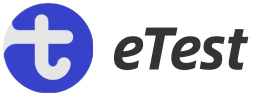

## hi there 👋

 

欢迎大家来到eTest社区 ,目前我们还是一个刚刚成长的团队，有很多不足需要成长的地方，我们会继续努力，为大家带来更加稳定的自动化测试工具，开放新的自动化测试功能，满足大家不同的测试场景，感谢大家支持

### 什么是eTest?

一个简单易用的集成测试框架

### 有什么优势？

- **0 代码，自动化测试**
- **完善的测试报告**
- **强大的扩展能力**
- **自动化运行定时任务以及测试结果推送机制**

### 加入社区

添加开发者微信，进群和小伙伴一起探索eTest,学习不在孤单，如果你有什么好的建议，或者在使用过程需要帮忙也可以加入，我们有专门的对接人，为你提供帮助，解决你在使用过程遇到的问题

 

### 快速了解eTest

[官网](https://alltheblue.github.io/docs/#/)  
[国内镜像](https://xflihaibo.gitee.io/e-test/#/)  
[视频教程](https://space.bilibili.com/668865078/channel/collectiondetail?sid=2371186)  
[文章专栏](https://juejin.cn/column/7208921659078754359) 

 ### 计划

